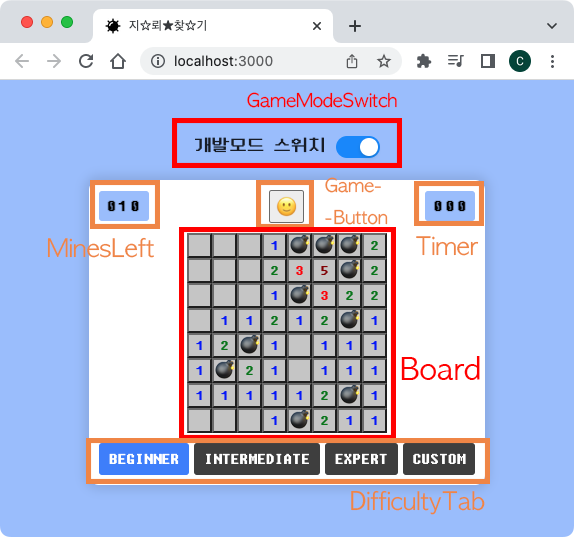

# Minesweeper

지뢰찾기를 클론한 프로젝트입니다.

## 사용 기술

## 과제 설명
- 지뢰찾기 게임입니다.
- 승패
  - 지뢰인 칸을 제외한 모든 칸을 열면 승리합니다.
    - 승리하면 열지 않았던 지뢰칸에 깃발이 꼽힙니다.
  - 지뢰가 있는 칸을 누르면 패배합니다.
    - 모든 지뢰 칸이 열리게 됩니다.
    - 지뢰가 없는데 깃발을 꼽았던 칸은 열리고 X 표시가 됩니다.
- 규칙
  - 맨 첫번째 누른 칸은 지뢰가 아닙니다. (지뢰일 시 해당 칸의 지뢰를 옮기도록 구현했습니다.)
  - 이웃한 지뢰의 숫자가 0인 칸을 누를 시, 상하좌우가 인접한 이웃한 지뢰의 숫자가 0인 칸을 모두 엽니다. 또한 이웃한 지뢰의 숫자가 0인 칸의 상하좌우대각선 칸까지 엽니다.
- 기능
  - 게임판 칸에서 우클릭을 하면 원래칸 -> 깃발 -> 물음표 -> 원래칸 -> .. 순서로 순환합니다. (이미 열린 칸은 우클릭해도 변하지 않습니다.)
  - '개발모드 스위치'를 on하면 열지 않은 칸도 지뢰 유무와 이웃 지뢰 수가 다 보이는 개발모드로 게임이 진행되고, off하면 열지 않은 칸은 보이지 않는 실전모드로 게임이 진행됩니다.
  - 상단 좌측 '남은 지뢰 수': 남은 지뢰의 수를 띄워줍니다. (지뢰 수 - 꼽은 깃발 수)로 계산하기에 0이더라도 게임이 끝나지 않을 수 있습니다. 
  - 상단 가운데 '이모지 버튼': 게임의 진행 상태에 따라 이모지가 변합니다. 게임 진행 중 누르면 실행되던 게임이 종료되고, 게임판이 재설정됩니다.
  - 상단 우측 '타이머': 칸을 하나 열면 게임이 시작된 것으로 간주해 타이머가 실행됩니다. 게임을 승리/패배하거나 999초에 도달하면 멈춥니다.
  - 난이도를 초급/중급/고급 중 선택할 수 있습니다.
  - 난이도를 커스텀할 수 있습니다.
    - 지뢰 0개, 게임판 크기 100x100 초과 등의 설정은 불가합니다.

## 컴포넌트 구성

## 실행 방법

1. `npm install`

프로젝트 실행에 필요한 패키지 파일들을 다운로드 받습니다.

2. `npm start`

프로젝트를 실행합니다.

http://localhost:3000/ 로 접속할 수 있습니다.
